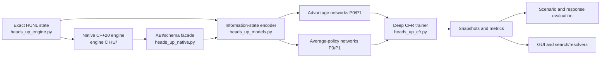
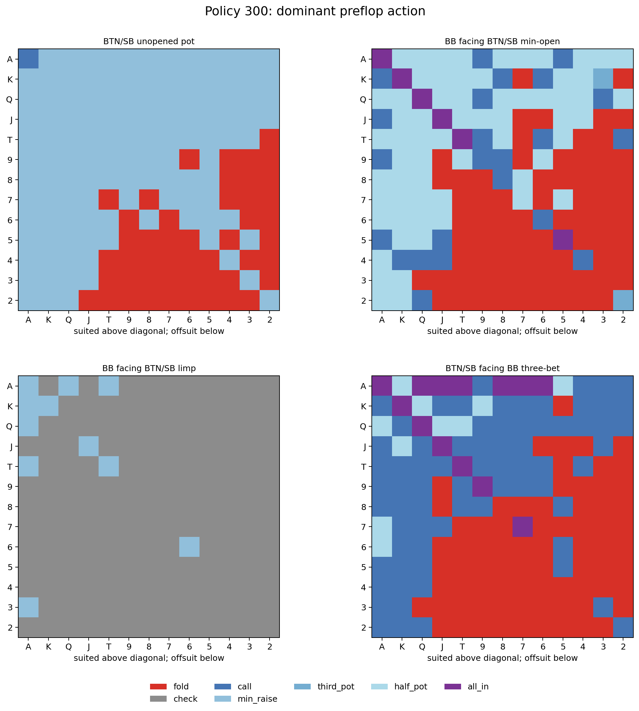
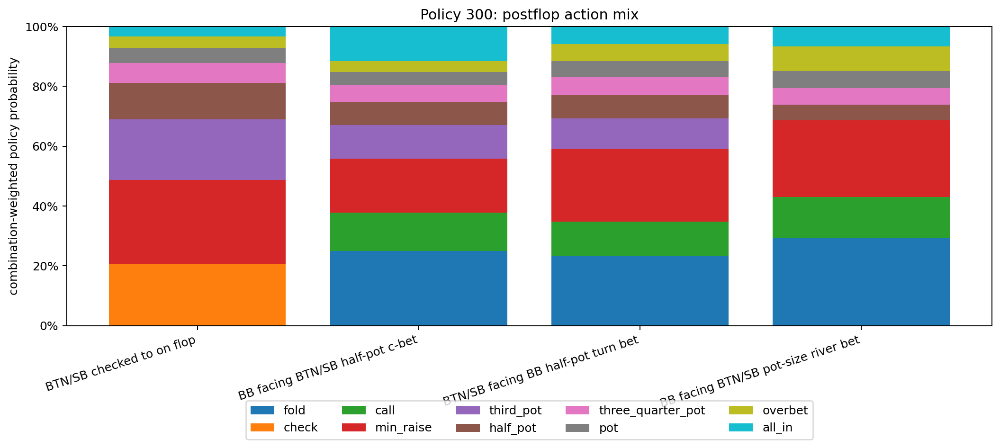

# pokerCFR

[](https://www.python.org/)
[](https://isocpp.org/)
[](LICENSE)

Research code for training, evaluating, and playing neural Counterfactual Regret Minimization poker agents. The primary path is heads-up no-limit Texas Hold'em (HUNL), with an exact integer-chip rules engine, a finite ten-action policy interface, Deep CFR training, native C++ acceleration, policy evaluation, and a desktop play GUI. A separate three-player implementation is retained as a legacy research path.

> [!IMPORTANT]
> This is experimental research software, not a solved-poker product or gambling system. Strategy charts, simulated EV, and learned-best-response results are diagnostics; they do not prove Nash convergence, real-money profitability, or safety for wagering.

## Highlights

- Readable Python reference engine plus a schema-checked C++20 engine.
- Exact off-tree `raise_to` actions alongside a stable ten-slot neural policy.
- Two-player zero-sum external-sampling Deep CFR.
- Structured card, public-state, legal-action, and ordered-history encoding.
- Resumable CPU/CUDA training, policy snapshots, reports, and scenario tests.
- Human-vs-policy GUI and bounded search/resolver experiments.
- Separate compatibility boundary for the older three-player stack.

## Architecture



The engine deliberately separates room actions from neural policy actions:

```python
state = env.step_exact(state, "raise_to", raise_to=237)  # exact chip target
state = env.step(state, policy_slot)                      # one of 10 slots
```

The finite policy uses fold, check, call, minimum raise, four pot fractions, a 1.5-pot raise, and all-in. Exact observed room raises remain exact in state and history; the engine derives legal policy targets without silently clamping them.

For the full invariants, checkpoint schema, training design, and limitations, read [README_HU.md](README_HU.md). The native implementation is in [`engine C HU/heads_up_native_engine.cpp`](engine%20C%20HU/heads_up_native_engine.cpp).

## Research snapshots

These are saved diagnostics from policy 300. They show what that particular model emitted under selected scenarios—not a GTO chart or a profitability claim.





## Quick start

### 1. Create an environment

Windows PowerShell:

```powershell
py -3.11 -m venv .venv
.\.venv\Scripts\Activate.ps1
python -m pip install --upgrade pip
python -m pip install -r requirements-heads-up.txt
```

Linux/macOS:

```bash
python3.11 -m venv .venv
source .venv/bin/activate
python -m pip install --upgrade pip
python -m pip install -r requirements-heads-up.txt
```

### 2. Run the correctness suite

```bash
python -m unittest test_heads_up_engine test_heads_up_models test_heads_up_training
```

Tests can run against the Python reference engine. The native extension is optional.

### 3. Build the native engine (optional)

Windows with Visual Studio Build Tools:

```powershell
& '.\engine C HU\build.bat'
```

Portable setuptools build:

```bash
python "engine C HU/setup.py" build_ext --inplace
```

The extension is Python-ABI-specific. Rebuild it for the Python version and platform you use.

### 4. Smoke-train

```bash
python train_heads_up.py --engine auto --iterations 1 --traversals 1 --adv-steps 1 --policy-steps 1 --batch-size 8 --eval-every 1 --eval-games 2 --save-every 1
```

For a CUDA campaign:

```bash
python train_heads_up.py --engine auto --device cuda --iterations 100
```

### 5. Play

On Windows, a configured policy launcher can be started with:

```powershell
.\run_heads_up_gui.bat
```

Or launch a specific compatible snapshot:

```bash
python play_heads_up_gui.py --policy path/to/policy.pt --human-seat 1
```

Policy files and large checkpoints are intentionally not committed. See [README_HU.md](README_HU.md#play-against-a-policy) for snapshot compatibility and manual two-seat mode.

## Repository map

| Path | Purpose |
| --- | --- |
| `heads_up_engine.py` | Python correctness reference for HUNL rules and exact actions |
| `engine C HU/` | C++20 native engine and build files |
| `heads_up_native.py` | Native/Python compatibility and ABI checks |
| `heads_up_models.py` | Information-state encoder and neural networks |
| `heads_up_cfr.py` | External-sampling Deep CFR implementation |
| `train_heads_up.py` | Resumable training CLI |
| `heads_up_training.ipynb` | Notebook training workflow |
| `heads_up_search.py` | Policy/search bridge |
| `play_heads_up_gui.py` | Human-vs-policy desktop GUI |
| `evaluate_heads_up_*.py` | Scenario, response, ensemble, and policy evaluation tools |
| `README_HU.md` | Detailed heads-up contracts and commands |
| `README_3PLAYER.md` | Separate legacy three-player path |

## Evaluation discipline

- Compare policies on reciprocal/common-random-number deals where supported.
- Report confidence intervals and preserve seat-label reversal exactly.
- Treat learned best response as a lower bound on exploitability, not exact exploitability.
- Keep training, validation, and final evaluation seeds separate.
- Record controller/search settings with every match result.
- Do not mix heads-up and three-player checkpoints, encoders, reservoirs, or native modules.

## Development

Contributions are welcome; see [CONTRIBUTING.md](CONTRIBUTING.md). Please do not commit model weights, checkpoints, hand histories, private keys, credentials, compiled extensions, or generated artifact trees. Security reports should follow [SECURITY.md](SECURITY.md).

## License

Source code is available under the [MIT License](LICENSE). Poker is regulated differently across jurisdictions; users are responsible for legal compliance and for keeping this research software away from real-money automation unless they have independently established that such use is lawful and safe.
